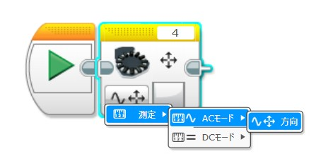
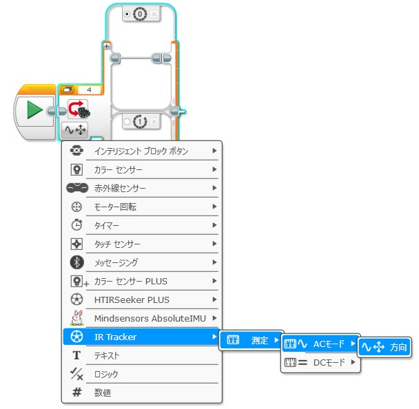

# MSIRTracker
## 概要 (Overview)
**MSIRTracker** は、[Mindsensors製 SPIKE用 IRセンサー「IRTracker」](https://www.mindsensors.com/SPIKE_Prime/89-irtracker.html) を **EV3 Labs** で使用可能にする拡張ブロックです。  ロボカップジュニアで使用される赤外線ボール（RCJ-05）の **Aモード** と **Bモード** に対応しています。

**MSIRTracker** is an extension block that enables the use of the  
[Mindsensors IR sensor “IRTracker” for SPIKE](https://www.mindsensors.com/SPIKE_Prime/89-irtracker.html) within **EV3 Labs**.  
It supports both **A mode** and **B mode** infrared signals used in RoboCup Junior (RCJ-05 ball).

## 方向 AC/DC 測定モード (Measure AC/DC Direction Mode)
赤外線信号の **方向** を取得するためのモードです。  
RCJサッカーで使用される赤外線ボール（Aモード / Bモード）の信号方向を読み取ることができます。

The **Measure AC/DC Direction Mode** retrieves the **direction** of the infrared signal.  
It can detect the signal direction of the RCJ soccer infrared ball (A mode / B mode).

## 方向 選択モード (Select AC/DC Direction Mode)
スイッチブロックで使用可能な**方向選択モード**です。
「MSIRTracker」→「測定」→「AC/DCモード」→「方向」を選択すると利用できます。

This is a **direction selection mode** for use with the Switch Block.
Select “MSIRTracker” → “Measure” → “AC/DC Mode” → “Direction” to access this mode.

## インストール方法 (Installation)
- [Releases ページ](https://github.com/namo02268/MSIRTracker/releases)より 「MSIRTracker.ev3b」 をダウンロード
- EV3ソフトウェアを起動し、[ツール] > [ブロック インポート] を開く
- ダウンロードした .ev3b ファイルを読み込む
- EV3ソフトウェアを再起動
- 追加されたブロックをプログラムにドラッグ＆ドロップして使用

---

- Download the "MSIRTracker.ev3b" file from the [Releases page](https://github.com/namo02268/MSIRTracker/releases).
- Launch the EV3 software and open [Tools] > [Block Import].
- Import the downloaded .ev3b file.
- Restart the EV3 software.
- Drag and drop the added blocks into your program to use them.
